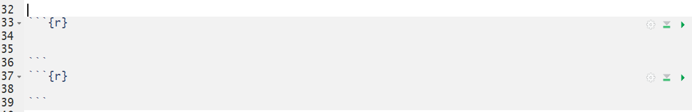

{width=90%}

  

***

# Save your work! 

When you can see this little blue disk icon, and your file tab is in red, you have work that is not saved!! Click the little blue save button. 

  

***

# Knit often!! 

This also performs a save automatically!

 

***

# Put white spaces between code chunks!

 

## For instance, do this:

 

 

## Do not do this:

 

 

***

# Only a little bit of code per chunk!!

### Or this will be you looking for your errors in a haystack of code. 

{width=30%}

 

***

# Put files into folders

## with sensible names...
## in places you can find! 

### Or this will be you looking for your files! 

 

***

